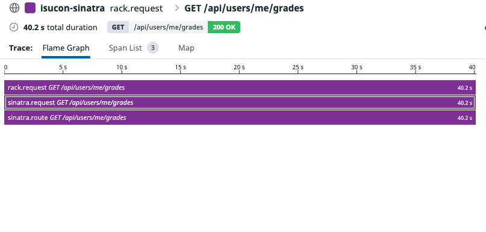
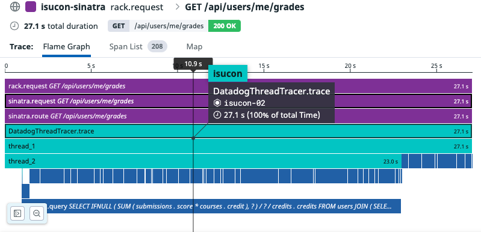

# DatadogThreadTracer

[datadog](https://github.com/DataDog/dd-trace-rb) helper to collect traces in thread

[](https://badge.fury.io/rb/datadog_thread_tracer)
[](https://github.com/sue445/datadog_thread_tracer/actions/workflows/test.yml)

## Example
### Before (without datadog_thread_tracer)


### After (with datadog_thread_tracer)


## Installation

Add this line to your application's Gemfile:

```ruby
gem 'datadog_thread_tracer'
```

And then execute:

    $ bundle install

Or install it yourself as:

    $ gem install datadog_thread_tracer

## Usage
```ruby
require "datadog_thread_tracer"

DatadogThreadTracer.trace do |t|
  t.trace do
    # do something. (this block is called in thread)
  end

  t.trace(trace_name: "trace_name") do
    # do something. (this block is called in thread)
  end

  # Pass single arg to Thread
  t.trace(thread_args: 1) do |a|
    a
    #=> 1
  end

  # Pass multiple args to Thread
  t.trace(thread_args: [2, 3]) do |a, b|
    a + b
    #=> 5
  end
end
```

## Development

After checking out the repo, run `bin/setup` to install dependencies. Then, run `rake spec` to run the tests. You can also run `bin/console` for an interactive prompt that will allow you to experiment.

To install this gem onto your local machine, run `bundle exec rake install`. To release a new version, update the version number in `version.rb`, and then run `bundle exec rake release`, which will create a git tag for the version, push git commits and the created tag, and push the `.gem` file to [rubygems.org](https://rubygems.org).

## Integration test
```bash
cp .env.example .env
vi .env
docker-compose up --build
```

## Contributing

Bug reports and pull requests are welcome on GitHub at https://github.com/sue445/datadog_thread_tracer.

## License

The gem is available as open source under the terms of the [MIT License](https://opensource.org/licenses/MIT).
